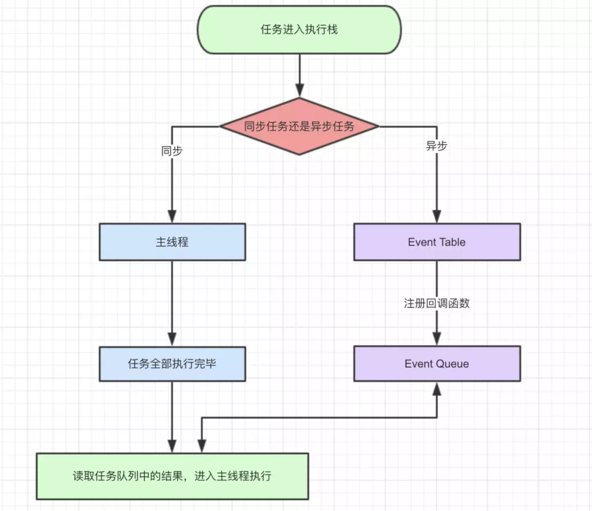

# JS事件循环机制
JS 执行是单线程的，它是基于事件循环的。事件循环大致分为以下几个步骤： 

+ (1)所有同步任务都在主线程上执行，形成一个执行栈（execution context stack）。
+ (2)主线程之外，还存在一个"任务队列"（task queue）。只要异步任务有了运行结果，就在"任务队列"之中放置一个事件。
+ (3)一旦"执行栈"中的所有同步任务执行完毕，系统就会读取"任务队列"，看看里面有哪些事件。那些对应的异步任务，于是结束等待状态，进入执行栈，开始执行。
+ (4)主线程不断重复上面的第三步。

主线程的执行过程就是一个 tick，而所有的异步结果都是通过 “任务队列” 来调度。 消息队列中存放的是一个个的任务（task）。 规范中规定 task 分为两大类，分别是 `宏任务` 和 `微任务`，并且每个 `宏任务` 结束后，都要清空所有的 `微任务`。 

在浏览器环境中，常见的 `宏任务` 有 script( 整体代码)、setTimeout、setInterval、MessageChannel、postMessage、setImmediate；常见的 `微任务` 有 MutationObsever 和 Promise.then

> macrotask（又称之为宏任务），可以理解是每次执行栈执行的代码就是一个宏任务（包括每次从事件队列中获取一个事件回调并放到执行栈中执行）；
每一个task会从头到尾将这个任务执行完毕，不会执行其它
浏览器为了能够使得JS内部task与DOM任务能够有序的执行，会在一个task执行结束后，在下一个 task 执行开始前，对页面进行重新渲染 （task->渲染->task->…）

> microtask（又称为微任务），可以理解是在当前 task 执行结束后立即执行的任务，也就是说，在当前task任务后，下一个task之前，在渲染之前；
所以它的响应速度相比setTimeout（setTimeout是task）会更快，因为无需等渲染，也就是说，在某一个macrotask执行完后，就会将在它执行期间产生的所有microtask都执行完毕（在渲染前）