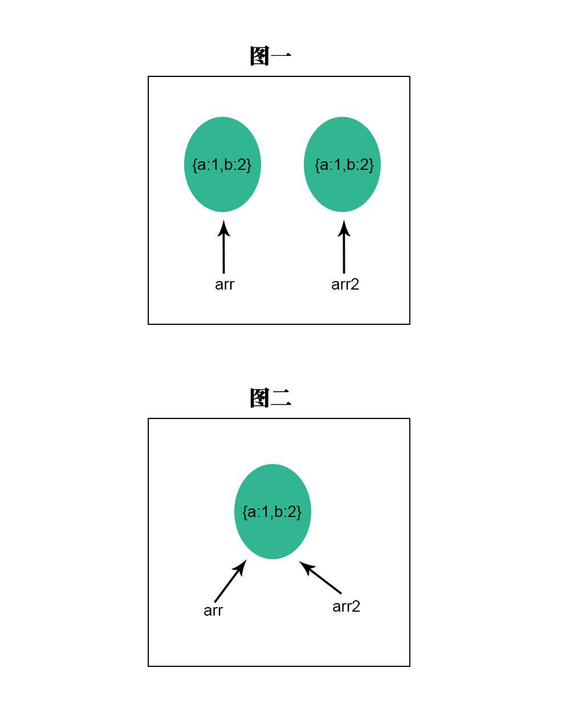

# JS合并多个对象并克隆出一个新对象
前端开发一般通过http请求拿到后台返回的JSON数据，多半为一个Object格式，对数据进行清洗、合并、深度克隆一个新对象，都是前端er无法绕考的工作，使用场景非常多。关于深度克隆并拷贝这个话题，很多人会觉得简单，但真让你写一套方法的时候，就会发现问题多多。

最近在看Axios源码，发现util.js工具库里的merge方法写的挺巧妙，现分享出来供给大家欣赏学习。
## 1、如何区分深拷贝、浅拷贝？
一般来说，基本数据类型的数据赋值给另外一个变量，是真正的“拷贝”，即两者完全脱离关系，各自修改值均不影响对方。反之，对于常见的复合型数据类型比如 Object、Array，变量与值之间仅仅是引用关系，当你试图将对象赋值给另外一个变量的时候，只不过是多一个变量指向这个对象而已。 
```js
var obj = {a:1,b:2};
var obj2 = obj;
```
你以为的是图一，其实真实关系是图二。<br />

## 2、如何实现拷贝？
常见的js内置拷贝方法都是浅拷贝，这里仅列出，不做过多的解读(欢迎补充)
+ Object.assign({a:1},{b:2})
+ Array.concat()
+ 点点点扩展运算符
+ JSON.parse(JSON.stringify(obj))  (这个有点暴力)
+ JQuery中的extend方法实现拷贝
+ lodash工具库中提供的 _.cloneDeep(obj) 方法
+ 数组slice方法拷贝  var arr2 = arr.slice(0)

## 3、Axios源码中实现的拷贝方式
```js
var toString = Object.prototype.toString;
function isArray(val){
    return toString.call(val) === '[object Array]';
}
function isObject(val){
    return toString.call(val) === '[object Object]';
}
function forEach(obj, fn) {
    if(obj === null || typeof obj === 'undefined'){
  return;
    }
    if(typeof obj !== 'object'){
        obj = [obj];
    }
    if(isArray(obj)){
        for (var i = 0, l = obj.length; i < l; i++) {
            fn.call(null, obj[i], i);
        }
    }else{
        for (var key in obj) {
      if (Object.prototype.hasOwnProperty.call(obj, key)) {
          fn.call(null, obj[key], key);
      }
  }
    }
}

function merge(/* obj1, obj2, obj3, ... */) {
    var result = {};
    function assignValue(val, key) {
  if (typeof result[key] === 'object' && typeof val === 'object') {
      result[key] = merge(result[key], val);
        }else{
      result[key] = val;
  }
    }
    for (var i = 0, l = arguments.length; i < l; i++) {
        forEach(arguments[i], assignValue);
    }
    return result
}
```
此方法是本文重点推荐，原理很简单，仔细看下即可明白。毕竟js内置的拷贝方法都很简单，学会手动实现拷贝，就可以覆盖常见开发需求了。